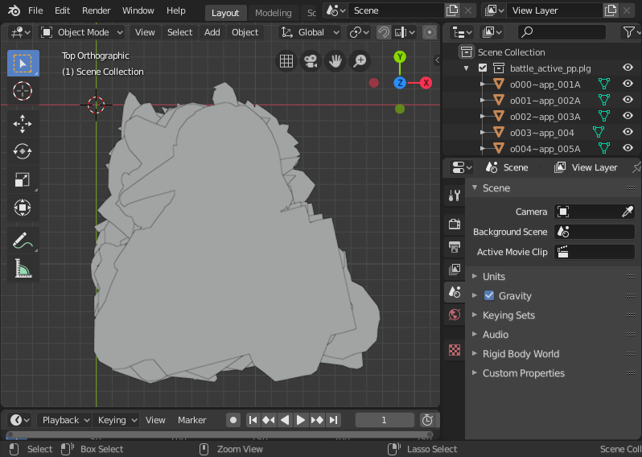
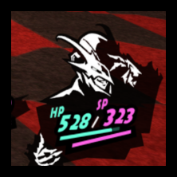
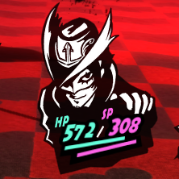
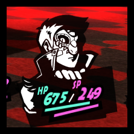
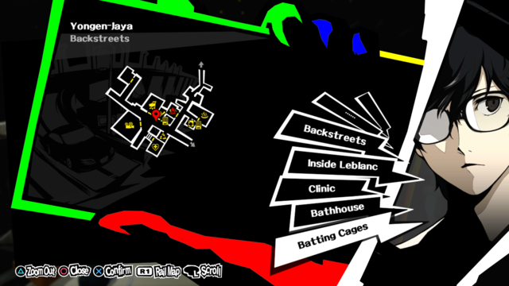

# PLG Import-Export Addon for Blender

A Blender Import-Export addon for the PLG format mesh collections found in some Atlus games.

## Requirements

- Blender 2.80+

## Installation

- Clone/download this repository into:
  - On Windows, `%USERPROFILE%\AppData\Roaming\Blender Foundation\Blender\<bl_ver>\scripts\addons`
  - On Linux, `$HOME/.config/blender/<bl_ver>/scripts/addons`
  - On macOS, `/Users/$USER/Library/Application Support/Blender/<bl_ver>/scripts\addons`
- Launch Blender, then under `Edit > Preferences`, select the `Addons` tab and enable `Import-Export: PLG format`.

## Usage

With this script you can:

- Import a PLG file to a blender mesh collection.
  - `File > Import > Import PLG (.plg)`
- Export a mesh collection to a PLG file.
  - Select a mesh collection, then `File > Export > Export PLG (.plg)`
  - In the `Export PLG` options panel, adjust the export options:
    - **Mystery Bytes**: Likely the PLG format version or game version.
    - **Auto Color**: Automatically sets the vertex colors for each mesh to `#ffffffff` (100% opaque white) for internal verts and `#ffffff00` (100% transparent white) for boundary verts.

## Creating a Custom PLG Mesh

1. Get a reference.
   - Use a vector editing software to create/trace a path, then import it into blender.
   - You can also use an image file directly. Import it as a reference/background image.
2. If needed, align the reference object.
   - The new mesh should be aligned with the object it will replace (this can be done using reference images).
   - Alternatively, you can sometimes align the meshes by replacing hardcoded offsets in the executable (this is how the game aligns the meshes).
3. Create a "frame" mesh.
   - Create a plane object with size `1.5m`.
   - Move/rotate the plane over the edge of imported image/path, so that the edge is in the middle of the plane.
4. Triangulate the "frame" mesh.
5. Fill the inner edge loop with triangle faces.
6. Optionally, you can color the mesh in Vertex Paint mode.
   - Color is ignored by the game most of the time, but some meshes (e.g. those that appear white in-game) are rendered with vertex colors intact.
7. Apply any modifications you've made to the mesh object (rotation, scale) and make sure the mesh origin is set to `(0, 0, 0)`.
8. You can now place your mesh in a PLG collection you've imported, and export that collection. If you want to export your custom vertex colors, make sure to disable the "Auto Color" option in the export options panel.

||||
|:-:|:-:|:-:|
||||

